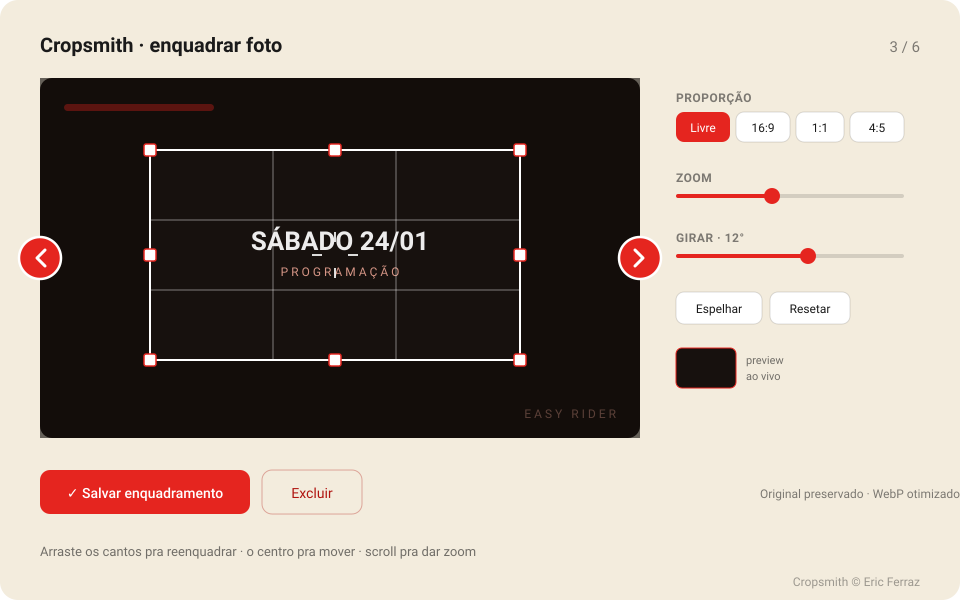
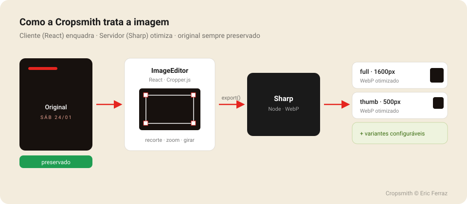
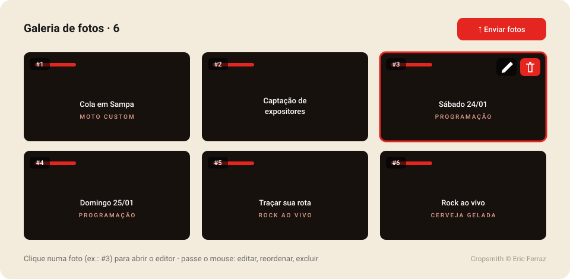

# Cropsmith

> Forje o enquadramento perfeito. Um **editor de imagem em React** (recorte com alças, zoom, rotação e espelhar) sobre o **Cropper.js**, junto de um **pipeline de otimização com Sharp** no Node — arraste pra reenquadrar, **o original é sempre preservado** e a saída sai em **WebP otimizado**.

[](./LICENSE)
[](#)
[](#)
[](#)

<p align="center">
  
</p>

---

## ✨ O que ela faz

- ✂️ **Recorte com alças** — arraste os **cantos** (diagonal) para redimensionar, as **bordas** para esticar um lado, o **centro** para mover. É o "pega e reenquadra" de verdade.
- 🔍 **Zoom** por scroll, pinça (touch) ou botões, com a imagem por trás.
- 🔄 **Rotação** em **qualquer ângulo** (slider fino + botões −90°/+90°).
- 📐 **Proporção** livre **ou** travada (16:9, 1:1, 4:5… configurável).
- ↔️ **Espelhar** (flip horizontal/vertical) e **resetar**.
- 🖼️ **Pipeline Sharp**: valida, normaliza EXIF, **preserva o original** e gera **derivadas WebP** (ex.: `full` 1600px e `thumb` 500px) — tamanhos configuráveis.
- ⚛️ **React 18/19**, **TypeScript** nativo, pronto pra **Next.js** (App Router). Cliente e servidor em entradas separadas (`cropsmith` e `cropsmith/server`).

<p align="center">
  
</p>

---

## 📦 Instalação

```bash
npm install cropsmith
# para o pipeline do servidor (opcional, peer):
npm install sharp
```

`react` e `react-dom` são **peer dependencies** (você já tem no seu app). O `cropperjs` já vem junto.

Importe o CSS do Cropper **uma vez** (ex.: no seu componente ou num CSS global):

```ts
import "cropperjs/dist/cropper.css";
```

---

## 🚀 Uso rápido

### 1) Cliente — o editor (React / Next.js)

```tsx
"use client";
import { useRef } from "react";
import { ImageEditor, type ImageEditorHandle } from "cropsmith";
import "cropperjs/dist/cropper.css";

export function CoverEditor({ src }: { src: string }) {
  const ref = useRef<ImageEditorHandle>(null);

  async function salvar() {
    // Renderiza o recorte (com zoom/rotação/flip) para WebP:
    const blob = await ref.current?.export({ type: "image/webp", quality: 0.92 });
    if (!blob) return;
    const fd = new FormData();
    fd.append("file", new File([blob], "crop.webp", { type: "image/webp" }));
    await fetch("/api/upload", { method: "POST", body: fd });
  }

  return (
    <div>
      <ImageEditor ref={ref} src={src} aspect={16 / 9} height={360} />
      <button onClick={salvar}>Salvar enquadramento</button>
    </div>
  );
}
```

### 2) Servidor — o pipeline (Node / Sharp)

```ts
import { processImage } from "cropsmith/server";

const buffer = Buffer.from(await file.arrayBuffer());

const { meta, original, variants } = await processImage(buffer, {
  variants: {
    full:  { width: 1600, quality: 82 },
    thumb: { width: 500,  quality: 78 },
  },
});

// original.buffer  → guarde o original (EXIF normalizado)
// variants.full    → WebP 1600px
// variants.thumb   → WebP 500px
```

> **Fluxo recomendado:** o cliente **renderiza o recorte** (`export()`) e envia o WebP; o servidor **otimiza e gera as derivadas**. É simples, fiel ao que o usuário viu, e funciona com rotação.
>
> **Alternativa (recorte no servidor):** envie o original + o `getCropData()` e use `extractCrop(original, crop)` — ideal quando `rotate === 0` (recorte a partir do original em alta qualidade).

---

## 🧩 Fluxo da galeria (editar uma a uma)

Combine com uma grade de miniaturas: o usuário sobe várias fotos, clica numa e abre o `ImageEditor` num modal — enquadra, ajusta os metadados e navega para a próxima.

<p align="center">
  
</p>

---

## 📚 API

### `<ImageEditor />` — props

| Prop | Tipo | Padrão | Descrição |
|---|---|---|---|
| `src` | `string` | — | URL / objectURL / dataURL da imagem. |
| `aspect` | `number \| null` | `null` | Proporção inicial travada (ex.: `16/9`). `null` = livre. |
| `aspectPresets` | `AspectPreset[]` | Livre, 16:9, 1:1, 4:5, 3:2 | Botões de proporção na barra. `[]` esconde. |
| `rotation` | `boolean` | `true` | Habilita o controle de rotação. |
| `flip` | `boolean` | `true` | Habilita os controles de espelhar. |
| `toolbar` | `boolean` | `true` | Mostra a barra embutida. |
| `height` | `number \| string` | `360` | Altura da área do editor. |
| `labels` | `Partial<EditorLabels>` | pt-BR | Textos da barra (i18n). |
| `className` | `string` | — | Classe do contêiner raiz. |
| `onReady` | `(h: ImageEditorHandle) => void` | — | Editor pronto (recebe a API). |
| `onChange` | `(d: CropData) => void` | — | Mudança do recorte (ao vivo). |

### `ImageEditorHandle` — API via `ref`

| Método | Retorno | Descrição |
|---|---|---|
| `getCropData()` | `CropData \| null` | Coordenadas do recorte (para processar no servidor). |
| `export(opts?)` | `Promise<Blob \| null>` | Renderiza o recorte para um `Blob`. |
| `exportDataURL(opts?)` | `string \| null` | Mesmo recorte como dataURL. |
| `rotateTo(deg)` | `void` | Define o ângulo absoluto. |
| `zoom(delta)` | `void` | Zoom relativo (ex.: `0.1`). |
| `flipHorizontal()` / `flipVertical()` | `void` | Espelha. |
| `setAspect(value)` | `void` | Trava a proporção (`null` = livre). |
| `reset()` | `void` | Volta ao estado inicial. |

### `cropsmith/server`

| Função | Descrição |
|---|---|
| `processImage(input, opts?)` | Valida + normaliza o original + gera as derivadas WebP. |
| `makeVariants(input, variants?, q?)` | Só as derivadas WebP. |
| `normalizeOriginal(input)` | Aplica orientação EXIF, mantém o formato. |
| `toWebp(input, width, q?)` | Converte para WebP limitando a largura. |
| `extractCrop(original, crop)` | Recorta a partir do original pelas coords do `CropData`. |
| `readImageMeta(input)` | Metadados (lança se inválida). |
| `DEFAULT_VARIANTS` | `{ full: 1600, thumb: 500 }`. |

Tipos exportados: `CropData`, `AspectPreset`, `ExportOptions`, `EditorLabels`, `ImageEditorProps`, `ImageEditorHandle`, `VariantSpec`, `ImageMeta`, `ProcessOptions`, `ProcessResult`.

---

## 🛠️ Tecnologias

As mesmas de um stack moderno de 2026 — e as mesmas que você provavelmente já usa:

- **TypeScript 5.7** (tipos completos inclusos)
- **React 18 / 19** (peer)
- **[Cropper.js](https://github.com/fengyuanchen/cropperjs) 1.6** — motor de recorte (MIT)
- **[Sharp](https://github.com/lovell/sharp)** — processamento de imagem no Node (Apache-2.0)
- **[tsup](https://github.com/egoist/tsup)** — build dual **ESM + CJS** com `.d.ts`
- **Node ≥ 20.9**

### Compatibilidade
Testado com **Next.js 15** (App Router, Server Actions / Route Handlers), React 19 e Node 20. Funciona em qualquer app React moderno.

---

## 🏗️ Build (para desenvolver a lib)

```bash
npm install
npm run build        # gera dist/ (ESM + CJS + tipos)
npm run typecheck
```

---

## 🙌 Créditos

Criado e mantido por **[Eric Ferraz](https://github.com/ericferraz)**.
Se usar a Cropsmith, mantenha o crédito (é o que a licença MIT pede) — e, se puder, deixe uma ⭐.

Construída sobre ombros de gigantes: **Cropper.js** (Fengyuan Chen, MIT) e **Sharp** (Lovell Fuller, Apache-2.0). Todo o crédito dessas bibliotecas é de seus autores.

## 📄 Licença

[MIT](./LICENSE) © 2026 Eric Ferraz. Use à vontade — pessoal ou comercial — mantendo o aviso de copyright.
